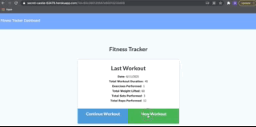

# Fitness Tracker • 

  ## Table of Contents

1. [Description](#description)
2. [Installation](#installation)
3. [Usage](#usage)
4. [License](#license)
5. [Contributing](#contributing)
6. [Tests](#tests)
7. [Questions](#questions)

## [Description](#description)
This application allows the user to view, create, and track daily workouts by allowing the user to log multiple exercises in a workout on a given day and tracks the name, type, weight, sets, reps, and duration of each exercise. This application utilizes a Mongo database with a Mongoose schema and handle routes with Express.

Deployed application: https://secret-castle-62479.herokuapp.com/

## [Installation](#installation)
To install necessary dependencies, run the following command: npm install, npm run seed, npm start

## [Usage](#usage)
Please review additional work that I have in my repo

## [License](#license)
This project is licensed under: 
[MIT](https://choosealicense.com/licenses/mit/)

## [Contributing](#contributing)
Follow up with me at bduran04@gmail.com

## [Tests](#tests)
npm test

## [Questions](#questions)
If you have questions, you can reach me at bduran04@gmail.com. You can find more of my work at [bduran04](https://github.com/bduran04)
